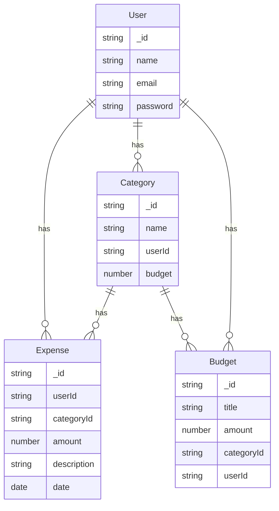

# Expense Tracker API

## Overview
This is a RESTful API for managing expenses, budgets, and categories for users. It allows users to track their spending, categorize expenses, and set budgets.

## Technologies Used
- **Node.js**
- **Express.js**
- **MongoDB** (Mongoose ORM)
- **JWT Authentication**

## Installation

1. **Clone the repository:**
   ```sh
   git clone https://github.com/yourusername/expense-tracker-api.git
   cd expense-tracker-api
   ```

2. **Install dependencies:**
   ```sh
   npm install
   ```

3. **Set up environment variables:** Create a `.env` file in the root directory and add the following:
   ```env
   PORT=5000
   MONGO_URI=your_mongodb_connection_string
   JWT_SECRET=your_secret_key
   ```

4. **Start the server:**
   ```sh
   npm start
   ```

## API Endpoints

### Authentication
| Method | Endpoint       | Description         |
|--------|---------------|---------------------|
| POST   | `/api/auth/register` | Register a new user |
| POST   | `/api/auth/login`    | User login         |

### Users
| Method | Endpoint      | Description        |
|--------|--------------|--------------------|
| GET    | `/api/users/:id` | Get user by ID |

### Categories
| Method | Endpoint         | Description                |
|--------|-----------------|----------------------------|
| POST   | `/api/categories` | Create a new category     |
| GET    | `/api/categories` | Get all categories        |
| GET    | `/api/categories/:id` | Get category by ID |

### Expenses
| Method | Endpoint       | Description                |
|--------|---------------|----------------------------|
| POST   | `/api/expenses` | Create a new expense      |
| GET    | `/api/expenses` | Get all expenses          |
| GET    | `/api/expenses/:id` | Get expense by ID |
| PUT    | `/api/expenses/:id` | Update an expense |
| DELETE | `/api/expenses/:id` | Delete an expense |

### Budgets
| Method | Endpoint     | Description         |
|--------|-------------|---------------------|
| POST   | `/api/budgets` | Create a new budget |
| GET    | `/api/budgets` | Get all budgets     |

## ER Diagram
The entity-relationship diagram (ERD) for this project:



## Running Tests
To run tests, use:
```sh
npm test
```

## License
This project is licensed under the MIT License.

